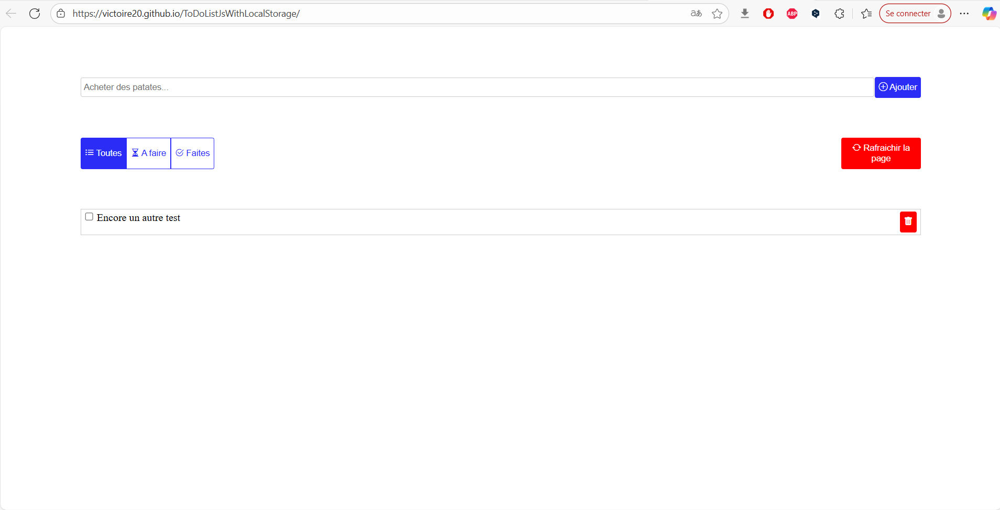

# 📝 Vanilla JS Todo App


Une application **Todo List** minimaliste écrite entièrement en **Vanilla JavaScript**, **HTML**, et **CSS**.  
Aucune librairie ou framework externe — tout est fait à la main pour apprendre la manipulation du **DOM**, la **POO**, et les **modules ES6**.

---

## 📁 Structure du projet

├── components/

│   └── TodoList.js      # Composant principal de la Todo List

│

├── functions/

│   ├── api.js           # Fonctions utilitaires pour les appels API

│   └── dom.js           # Fonction utilitaire pour créer des éléments DOM

│

├── app.js               # Point d'entrée principal

├── index.html           # Page HTML principale

└── style.css            # Styles CSS de base


---

## 🚀 Fonctionnalités

- ✅ Chargement initial des tâches depuis l’API [JSONPlaceholder](https://jsonplaceholder.typicode.com/)
- ✅ Ajout d’une nouvelle tâche via le formulaire
- ✅ Marquage des tâches comme **faites** ou **à faire**
- ✅ Suppression visuelle des tâches
- ✅ Filtrage par catégorie :
  - Toutes
  - À faire
  - Faites
- ✅ Rafraîchissement manuel de la liste

> ⚠️ Les ajouts et suppressions sont **locaux uniquement** — ils ne modifient pas les données distantes sur l’API.

---

## ⚙️ Détails des fichiers

### 🧩 `components/TodoList.js`

Classe principale `TodoList` :
- Génère le formulaire et les boutons de filtrage.
- Instancie et gère chaque élément de tâche via `TodoListItem`.
- Écoute les événements du formulaire et des boutons.

Classe interne `TodoListItem` :
- Représente une tâche individuelle.
- Gère la suppression visuelle et le changement d’état (fait / à faire).

---

### 🌐 `functions/api.js`

Gère les appels HTTP avec `fetch` de manière asynchrone.

```js
export async function fetchAPI(url, options = {}) {
    const headers = { Accept: 'application/json', ...options.headers }
    const r = await fetch(url, { ...options, headers })
    if (r.ok) {
        return r.json()
    }
    throw new Error('Erreur serveur', { cause: r })
}

## 🧠 Concepts utilisés

- 📦 **Modules ES6** (`import` / `export`)
- 🔒 **Classes privées** (`#`)
- 🧩 **Manipulation du DOM** sans framework
- ⚙️ **Gestion asynchrone** avec `async / await`
- 🧾 **Typage** avec **JSDoc**
- 🧠 **Programmation orientée objet (POO)** en JavaScript

---

## 💡 Exemple de rendu




